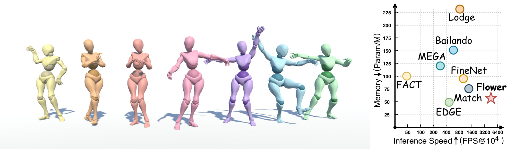

<h1 align="center">🌸 FlowerDance</h1>
<h3 align="center">MeanFlow for Efficient and Refined 3D Dance Generation</h3>

<p align="center">
  <a href="https://arxiv.org/abs/2511.21029">
    
  </a>
  <a href="https://sun-happy-ykx.github.io/FlowerDance/">
    
  </a>
  <a href="#code">
    
  </a>
</p>

<p align="center">
  
</p>

> **Abstract**: Music-to-dance generation translates auditory signals into expressive human motion, yet existing approaches still struggle to balance refined 3D motion quality with strict inference budgets. FlowerDance is designed for both physically plausible, artistically expressive motion and efficient generation in speed and memory usage.
>
> FlowerDance combines MeanFlow with Physical Consistency Constraints for high-quality few-step sampling, and uses a lightweight non-autoregressive BiMamba backbone with Channel-Level Fusion for long-horizon music-to-dance synthesis. It also supports motion editing through time-decayed soft masking, enabling users to refine generated dance sequences interactively.

🎉 **FlowerDance has been accepted to ECCV 2026!**
✨ Training code release! ✨

---

<a id="code"></a>

## 🚀 Code

### 🛠️ Set up the Environment

To set up the necessary environment for running this project, follow the steps below:

1. **Create a new conda environment**

   ```bash
   conda create -n Flower_env python=3.10
   conda activate Flower_env
   ```

2. **Install PyTorch (CUDA 12.8)**

   ```
   pip install torch==2.7.1+cu128 torchvision==0.22.1+cu128 torchaudio==2.7.1+cu128 \
       --index-url https://download.pytorch.org/whl/cu128
   ```
   
3. **Install remaining dependencies**

   ```bash
   pip install -r requirements.txt
   ```

---

## 📦 Download Resources

- Download the complete **preprocessed data archive** from [Hugging Face](https://huggingface.co/datasets/xlt99/FlowerDance-Preprocessed/resolve/main/data.7z?download=true) and extract it in the project root. The archive contains the required `./data/` directory.
- Download the **evaluation checkpoint** from [Hugging Face](https://huggingface.co/xlt99/FlowerDance/resolve/main/train-3700.pt?download=true) and place it at `./runs/train/uniform2/weights/train-3700.pt`.

---

## 🧩 Directory Structure

After downloading the necessary files, ensure the directory structure follows the pattern below:

```
FlowerDance/
    │                
    ├── data/                 
    ├── dataset/             
    ├── model/                               
    ├── runs/  
    ├── requirements.txt
    ├── args.py  
    ├── EDGE.py
    ├── inpaint.py
    ├── test.py
    └── vis.py     
```
---

## 🏋️ Training

```bash
export WANDB_MODE=offline
accelerate launch train.py --batch_size 128  --epochs 4000 --feature_type baseline
```
---

## 📏 Evaluation

### 🧪 Evaluate the Model

To evaluate the our model’s performance:

```bash
python test.py --batch_size 128
```


---

## 🙏 Acknowledgements

This code is standing on the shoulders of giants. We want to thank the following contributors that our code is based on: [EDGE](https://github.com/Stanford-TML/EDGE), [Adan-pytorch](https://github.com/lucidrains/Adan-pytorch), [denoising-diffusion-pytorch](https://github.com/lucidrains/denoising-diffusion-pytorch), [Mamba](https://github.com/state-spaces/mamba), [causal-conv1d](https://github.com/Dao-AILab/causal-conv1d), and [fairmotion](https://github.com/facebookresearch/fairmotion). The preprocessed data builds on [AIST++](https://github.com/google/aistplusplus_api) and [FineDance](https://github.com/li-ronghui/FineDance).

---

## 📄 Citation

```bibtex
@article{yang2025flowerdance,
  title={FlowerDance: MeanFlow for Efficient and Refined 3D Dance Generation},
  author={Kaixing Yang and Xulong Tang and Ziqiao Peng and Xiangyue Zhang and Puwei Wang and Jun He and Hongyan Liu},
  journal={arXiv preprint arXiv:2511.21029},
  year={2025}
}
```
